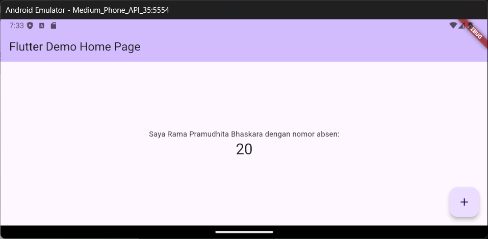
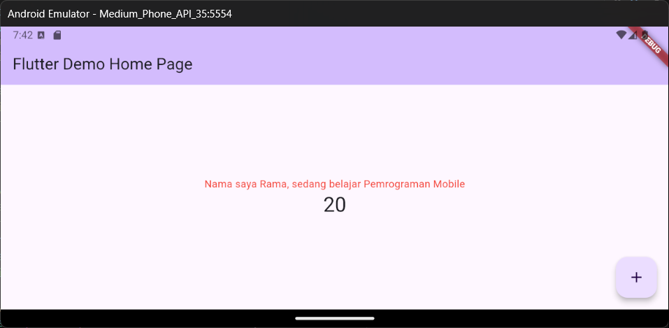
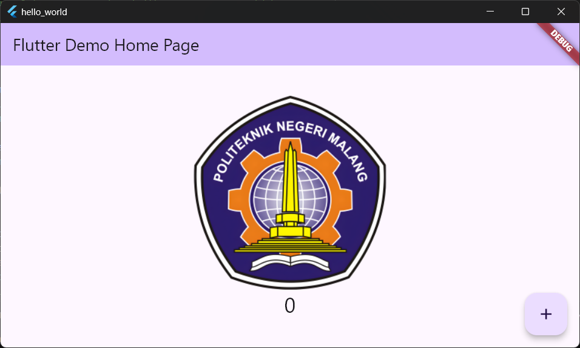
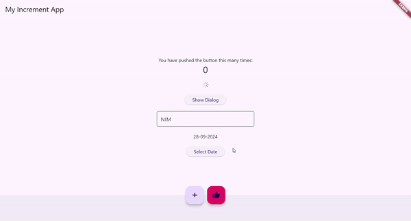

# Identitas Diri
Nama : Rama Pramudhita Bhaskara

No : 20

NIM : 2241720128

# Langkah Praktikum
## Praktikum 2: Menghubungkan Perangkat Android atau Emulator

## Praktikum 3: Membuat Repository GitHub dan Laporan Praktikum

## Praktikum 4: Menerapkan Widget Dasar
### Text Widget

### Image Widget

## Praktikum 5: Menerapkan Widget Material Design dan iOS Cupertino

